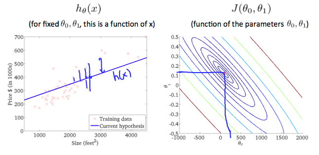

## 1.1 Model Representation

### Symbols
|Symbol|Meaning|
|--|--|
|m|Number of training egs|
|x's|input var|
|y's|output var|
|${x^{(i)}}$|ith Data (i as index)|
|**h** as hypothesis| estimate function|

### Problem
How to represent h? 
单变量回归
${h_\theta(x) = \theta_0 + \theta_1*x}$

## 1.2 Cost Function
单变量回归平方损失函数
${
J(\theta_0, \theta_1) = \dfrac {1}{2m} \displaystyle \sum _{i=1}^m \left ( \hat{y}_{i}- y_{i} \right)^2 = \dfrac {1}{2m} \displaystyle \sum _{i=1}^m \left (h_\theta (x_{i}) - y_{i} \right)^2
}$

${\theta_0= 0}$ 对应的损失函数为一二次函数
${\theta_0 \not= 0}$ 对应损失函数为三维函数，截面图如下：

